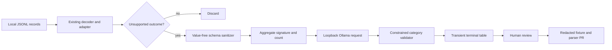

# Local schema advisor design

## Status

Approved design. This document defines a development-only analysis aid. It does not authorize a Metermaid runtime feature, new stable CLI command, parser expansion, or change to the completed M5 disposition.

## Goal

Accelerate review of Metermaid `unsupported` diagnostics without allowing an AI model to inspect or persist transcript content, determine production parser behavior, or contact a non-local service.

The advisor groups value-free schemas for currently unsupported records and asks a user-configured local Ollama model to assign each group one advisory category. A human retains exclusive authority to promote a shape into an adapter.

## Scope

In scope:

- A developer-only source script, invoked with `uv run python`, outside Metermaid's seven stable CLI commands.
- Value-free structural summarization of locally discovered source records.
- Aggregation by agent, safe discriminator, and structural schema signature before any model call.
- An opt-in, loopback-only Ollama endpoint configured by the user.
- Machine-readable, constrained advisory categories with no free-text model rationale retained or emitted.
- A documented human promotion path from an advisory result to a redacted fixture, test, narrow adapter mapping, and adapter-revision replay.

Out of scope:

- Metermaid's normal `ingest`, `watch`, `status`, `doctor`, `report`, `export`, or `import-legacy` behavior.
- Automatic adapter changes, event writes, diagnostic suppression, database schema changes, model downloading, background service operation, or telemetry.
- Sending any data to a remote endpoint, accepting arbitrary HTTP hosts, model authentication, or persisting the model's output.
- Reopening M5 or adding deferred capability work during the Sep 2–15 evidence-only extension.

## Configuration

The advisor reads one explicit TOML configuration file. The script accepts `--config PATH`; without it, it resolves `$XDG_CONFIG_HOME/metermaid/schema-advisor.toml`, falling back to `~/.config/metermaid/schema-advisor.toml` when `XDG_CONFIG_HOME` is unset.

The file is absent by default. The advisor refuses to run unless its dedicated opt-in is set:

```toml
[schema_advisor]
enabled = true
endpoint = "http://127.0.0.1:11434/api/generate"
model = "gemma4:12b-mlx"
timeout_seconds = 30
```

`endpoint` must be an `http` URL whose hostname resolves syntactically to `127.0.0.1`, `localhost`, or `::1`, and whose path is exactly Ollama's `/api/generate`. The advisor rejects every other endpoint before opening a socket. `model` must be non-empty. `timeout_seconds` must be an integer in the closed interval 1–120.

The normal package installation does not create this file, import advisor code, resolve a model, or open a socket.

## Architecture



The script reuses documented discovery and the existing pure adapters only to identify records that already yield an `unsupported` outcome. It never writes their records, values, paths, raw identifiers, timestamps, model labels, prompt text, response text, tool arguments, tool results, or adapter outcome to the Metermaid database.

The sanitizer produces a canonical structural summary containing only:

- Pilot agent name.
- Safe top-level and nested discriminator labels already eligible for `doctor` output.
- JSON field paths.
- JSON value types (`object`, `array`, `string`, `integer`, `number`, `boolean`, `null`).
- Presence or absence of generic numeric-counter field names from a fixed source-controlled allowlist.
- Aggregate count of identical structural signatures.

It never includes a scalar value, list length, raw source path, project key, session identifier, timestamp, model name, or arbitrary field name. The existing field-name policy remains the first filter; this advisor tightens it further to a source-controlled field-path allowlist. Unknown field names become `<redacted-field>` before aggregation or request construction.

The script sends one prompt per unique structural signature, never one prompt per source record. The static prompt asks for one JSON object with a single `category` field selected from this closed set:

- `expected-envelope`
- `non-usage-message`
- `possible-usage-shape`
- `needs-human-review`

The Ollama call requests JSON output. The validator rejects non-JSON, extra fields, unrecognized categories, timeouts, non-2xx responses, and oversized responses. Every such failure terminates that signature with `needs-human-review`; it never invents a parser mapping or silently relabels a diagnostic.

The terminal table shows only the aggregate signature identifier, agent, safe discriminator, count, and validated category. It prints no model rationale. The script creates no database row, cache, transcript copy, log, fixture, or export.

## Human promotion gate

`possible-usage-shape` is a triage priority, not proof. A human may promote a shape only by following Metermaid's existing evidence path:

1. Re-run the source-schema audit on a selected local source and review its output.
2. Create a manually reviewed redacted fixture that preserves field names and replaces every value.
3. Add an adapter contract/regression test proving the exact mapping and nullability behavior.
4. Implement one narrow deterministic adapter change.
5. Increment only that adapter's semantic revision so historical unsupported records replay safely.
6. Run the repository verification gate.

A model category never enters `ingest_diagnostics`, normalized events, reports, exports, or persisted configuration-derived data.

## Failure handling

Configuration is validated before transcript discovery. Invalid, absent, disabled, non-loopback, or malformed configuration fails loudly without opening a socket. An unavailable Ollama server or a rejected model response leaves all source data untouched and returns a non-zero process exit after printing only a structural failure category. The script has no fallback cloud provider.

## Verification

Tests must demonstrate:

- No advisor module is imported by any of the seven stable CLI commands.
- A missing config and `enabled = false` make no socket call.
- Every non-loopback endpoint and every non-Ollama path is rejected before connection.
- A seeded prompt, raw path, session ID, timestamp, model label, tool argument, and tool result cannot appear in the sanitized request, terminal output, or any created file.
- Identical sanitized schemas produce one request with the correct aggregate count.
- The response validator accepts only one closed-set category and rejects free text, extra fields, malformed JSON, and unknown categories.
- Advisor output cannot write Metermaid's SQLite store or alter `doctor` counts.
- A parser promotion still requires a redacted fixture, deterministic adapter test, and adapter revision replay.

## M5 status

M5's Aug 17–30 dogfood period is complete and its `ITERATE` disposition is final. The Sep 2–15 process is an evidence-only extension for the corrected build. This advisor remains deferred until that extension concludes or a separately approved plan authorizes it.
