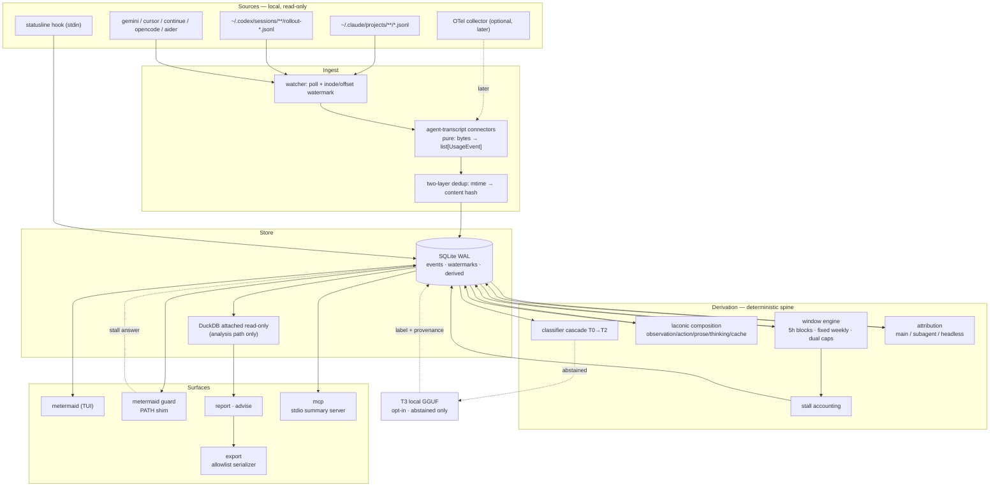
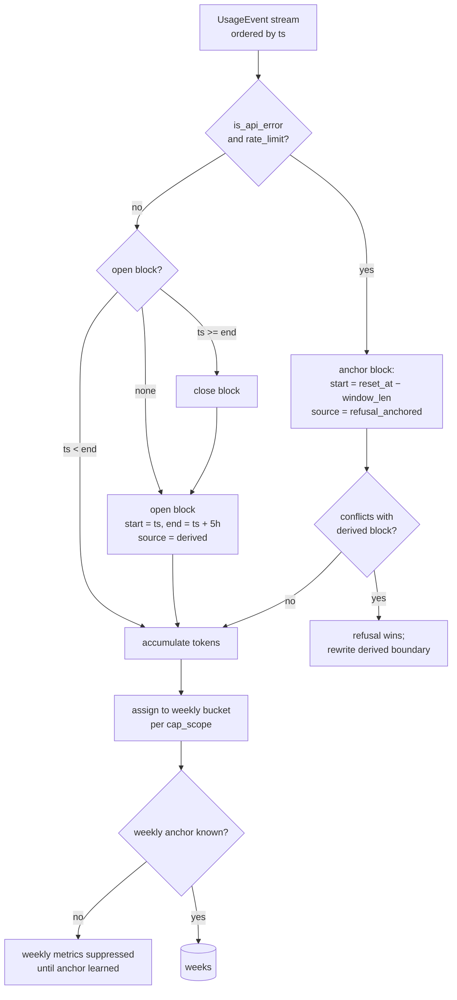
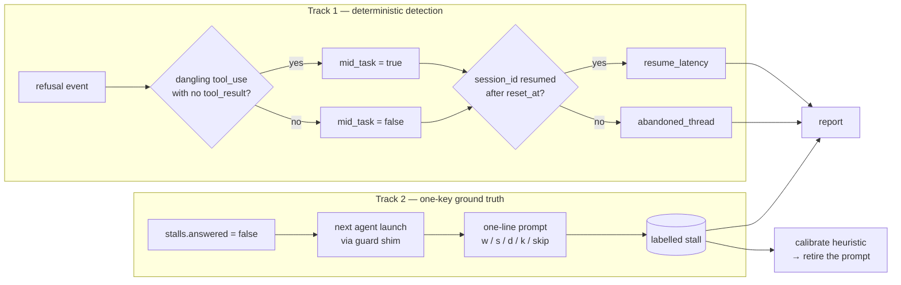
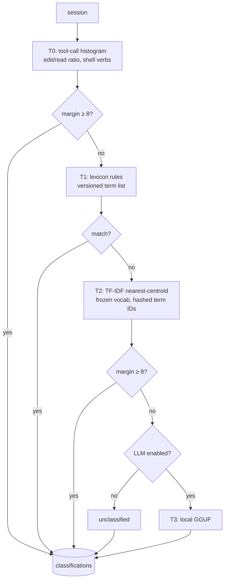
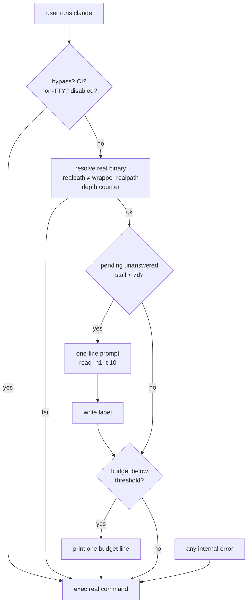
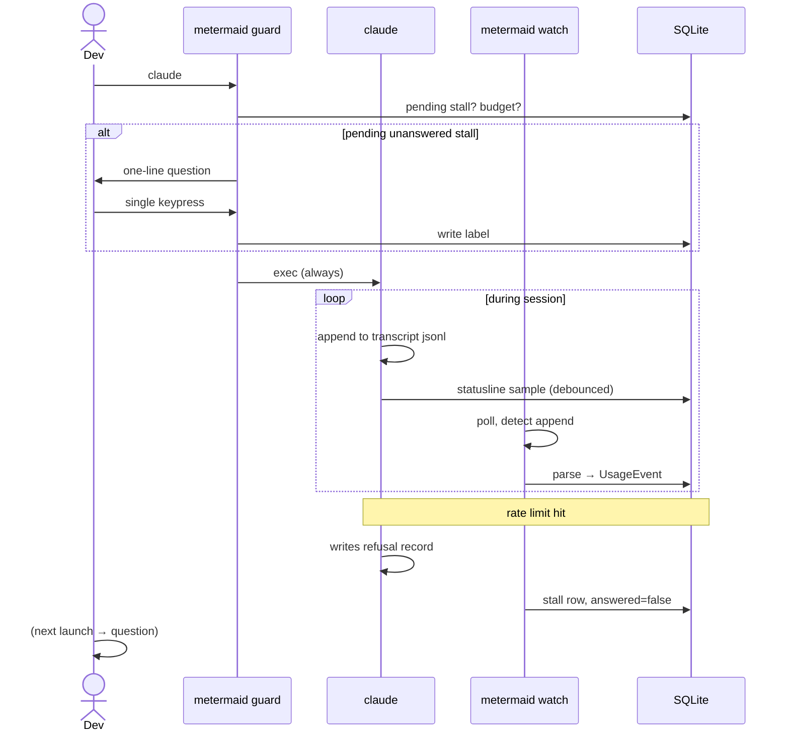
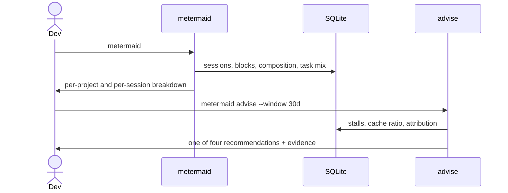
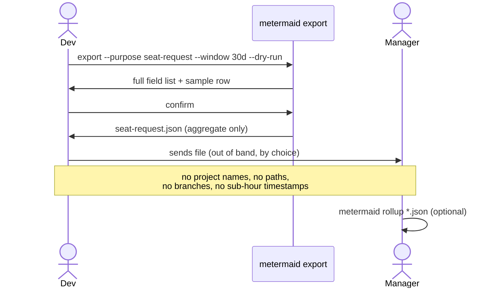
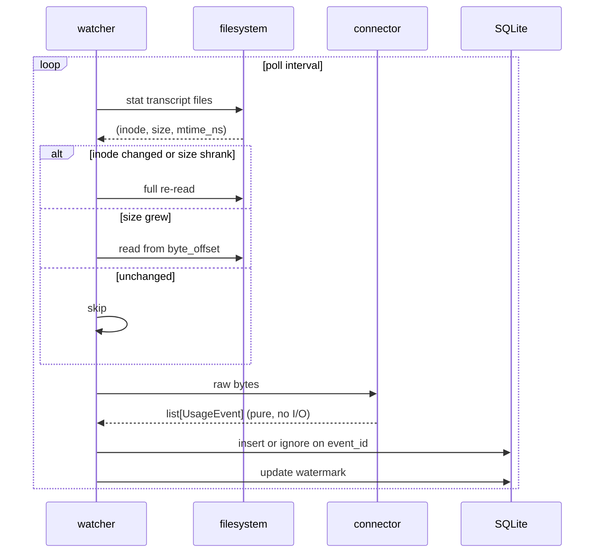

# metermaid — System Design

**Repo:** `github.com/Mathews-Tom/metermaid`
**Document date:** 2026-08-16
**Companion:** [system overview](system-overview.md)

> **Status: deferred design reference.** This document is not the approved v1 implementation scope or a statement of shipped behavior. Its rate-limit, stall, classifier, TUI, PATH-guard, OpenTelemetry ingest, and local-model proposals require their stated evidence gates before promotion.

---

## 1. Design constraints

Non-negotiable. Every decision below traces to one of these.

| # | Constraint | Enforcement |
|---|---|---|
| C1 | No network activity at any stage | Dependency-closure CI gate, runtime socket guard, network-namespace test isolation |
| C2 | No user data leaves the machine except by explicit command | Allowlist export serializer; canary property tests |
| C3 | All reported numbers are deterministic | Frozen vocabularies, content-hash caches, byte-identical output tests |
| C4 | Optional local LLM only for cases the deterministic cascade abstains on | Off by default; separate extra; `provenance` tag on every derived label |
| C5 | Never blocks or degrades the primary agent | Guard fails open on every path; watcher is read-only and out-of-process |
| C6 | Prompt text never persists | No free-text field exists in the data model |

### 1.1 The quota constraint

Anthropic publishes plan multipliers, not token quotas. A `pct_of_limit_consumed` computed
from token counts has an invented denominator. Two legitimate channels exist:

| Channel | Provides | Character |
|---|---|---|
| Rate-limit refusal in transcript | `reset_at`, authoritative block boundary, weekly anchor | Lagging, exact |
| Statusline render | The client's own numerator and denominator | Leading, best-effort |

The refusal event is worth more than it appears. A 5-hour refusal at 14:32 with reset at
16:10 establishes that the block opened at 11:10 — retroactive ground truth. A weekly
refusal reveals the account's fixed weekly anchor, which is otherwise underivable. One
refusal per account bootstraps the entire window configuration.

Design consequence: the window engine is **event-sourced and reconciling**, treating the
statusline as a live estimate and refusal events as truth.

### 1.2 Limits as data

Claude Code limit semantics changed at least three times between August 2025 and May 2026
(weekly caps added; a temporary peak-hour reduction; permanent doubling of 5-hour limits
and removal of peak throttling on 2026-05-06). Any constant compiled into code will be
wrong within a quarter.

All limit semantics live in `limits/<vendor>.toml`, versioned with `effective_from`. The
engine selects the row valid at **each event's timestamp**, not at report time, so
historical windows stay correct across regime changes.

---

## 2. Architecture



The dotted LLM edge is the only non-deterministic path. It is disabled by default and its
outputs carry `provenance: llm` through every view and export.

### 2.1 Storage decision

SQLite in WAL mode as system of record; DuckDB attached read-only for analysis.

| Requirement | SQLite | DuckDB |
|---|---|---|
| Frequent small appends from a long-lived writer | Good | Poor |
| Concurrent reader (TUI) during writes | Good (WAL) | Single-writer limits |
| Columnar group-bys over months of events | Adequate | Excellent |
| Zero-config, single file, ubiquitous | Yes | Yes |

Hot path stays boring; analysis path gets columnar speed. Using DuckDB alone would put a
single-writer OLAP engine underneath a live tailer, which is the wrong shape.

This replaces metermaid's current CSV-as-store model. CSV survives as an export format
only.

### 2.2 Watermarking

Per file: `(path, inode, size, mtime_ns, byte_offset, sha256_of_last_line)`.

- Append detected (size grew, inode same) → parse from `byte_offset`.
- Truncation or inode change → full re-read, dedup by `event_id`.
- `event_id = sha256(agent, session_id, record_uuid)` makes re-reads idempotent.

---

## 3. Data model

```python
class UsageEvent(BaseModel):
    schema_version: Literal[1]
    event_id: str
    agent: AgentKind
    session_id: str
    project_key: str  # HMAC(machine_salt, abspath) — raw path never stored
    git_branch: str | None
    ts: datetime  # tz-aware UTC
    role: Literal["user", "assistant", "system", "tool_result"]
    model: str | None
    input_tokens: int
    output_tokens: int
    cache_creation_tokens: int
    cache_read_tokens: int
    thinking_tokens: int | None  # None = not reported; 0 = reported zero
    cost_usd: Decimal | None  # captured-only after the explicit v1 cutover
    tool_name: str | None
    tool_target_kind: ToolTargetKind | None  # file | shell | search | web | mcp
    is_api_error: bool
    error_class: (
        ErrorClass | None
    )  # rate_limit_5h | rate_limit_weekly | overloaded | other
    reset_at: datetime | None
    turn_index: int
    parent_uuid: str | None
    attribution: Attribution  # main | subagent | headless
```

Two invariants that matter more than the field list:

1. **No free-text field.** Not truncated, not redacted — absent. Classification features
   are computed during parse and only the feature vector survives. This is stronger than
   redaction because absence has no failure surface.
2. **`thinking_tokens: None` ≠ `0`.** Collapsing absent into zero produces a report
   claiming nobody uses extended thinking.

### 3.1 Derived tables

| Table | Grain | Key contents |
|---|---|---|
| `sessions` | session | start/end, turn count, model mix, project, attribution |
| `blocks_5h` | block | open/close, token totals, source (`derived` \| `refusal_anchored`) |
| `weeks` | (anchor, cap_scope) | `cap_scope ∈ {all_models, sonnet_only}` |
| `stalls` | refusal event | blocked_at, reset_at, mid_task, resume info, `answered` |
| `composition` | session and turn | observation/action/prose/thinking/cache token split |
| `classifications` | session | bin distribution, primary_bin, margin, provenance |
| `statusline` | debounced sample | vendor numerator/denominator per scope |

`weeks` is keyed on `cap_scope` because Max and Team plans carry two weekly caps — one
across all models, one Sonnet-only. A developer can be weekly-blocked on Sonnet with
all-models headroom, and a scalar weekly model reports that wrong.

---

## 4. Window engine



### 4.1 Rules

**5-hour blocks.** Rolling: first event opens, closes 5h later, next event after close
opens a new one. This is a *reconstruction* and drifts from the vendor's internal state
whenever quota was consumed outside the transcript — claude.ai, Cowork, another machine.
The subscription bucket is shared across all of them, so transcript-derived tokens are a
**lower bound**. Every view showing block consumption must carry that caveat inline, not
in a footnote.

**Refusal anchoring.** A refusal at time `t` with `reset_at = r` proves the block opened
at `r − 5h`. Where an anchored boundary conflicts with a derived one, the anchor wins and
the derived boundary is rewritten. Blocks carry `source` so the UI can distinguish
"reconstructed" from "confirmed."

**Weekly.** Fixed and account-assigned; not derivable from usage. Resolution order:
statusline-reported reset → `reset_at` from an observed weekly refusal → one-time user
config → **suppress weekly metrics entirely**. Never default to Monday 00:00 UTC; a wrong
anchor produces confidently wrong weekly charts.

---

## 5. Stall accounting

The metric leadership cares about and the one most likely to be wrong. The honest framing:
**you cannot observe whether a human was idle.** You can observe that the tool refused to
work, and you can ask.

### 5.1 Two-track approach



### 5.2 Reported quantities

Countable only. Never composited into an hours-lost figure.

| Metric | Definition | Basis |
|---|---|---|
| `n_interrupts` | Refusals where `mid_task = true` | Structural |
| `mid_task` | A `tool_use` block exists with no matching `tool_result` at `blocked_at` | Structural — the agent was cut off mid-edit |
| `resume_latency` | Time from `blocked_at` to next turn **in the same session** | Observed |
| `abandoned_thread_rate` | Fraction of interrupted sessions never resumed | Observed |
| `block_ceiling` | `reset_at − blocked_at` | Vendor-reported |
| `by_hour` | Histogram of `blocked_at` in local time | Observed |
| `label` | User's one-key answer | Reported by the human |

`abandoned_thread_rate` is the strongest argument the tool can make. "31% of interrupted
work threads were never resumed" is countable and hard to dispute. "We lost 14 hours" is
neither.

Report 5-hour and weekly blocks separately — a weekly block is a different failure mode
measured in days, and averaging them together destroys the signal.

### 5.3 The prompt

Rules, all of them adoption-critical:

- At most one question per launch.
- Only for stalls less than 7 days old and unanswered.
- A skipped question is re-asked at most once, ever.
- Never on `--resume` / `-c`, never on non-TTY, never in CI.
- `read -n1 -t 10`; timeout is a skip, not a block.

The prompt is a bootstrap, not a permanent tax. After roughly 200 labelled stalls, fit the
deterministic heuristic against the labels, publish its accuracy, and retire the prompt.

---

## 6. Composition attribution

`laconic`'s session composition decomposes token spend into semantic buckets. This is the
answer to "where did my tokens go," and no other tool in the space produces it.

| Bucket | Contents | Lever it implies |
|---|---|---|
| `observation` | File reads, search hits, command output | laconic's file-observation encoder; ignore-file hygiene |
| `action` | Tool calls, patches | Fewer, larger edits |
| `prose` | Assistant natural-language output | Terser output style |
| `prompt` | User turns, system prompt, CLAUDE.md | Instruction-file size audit |
| `thinking` | Reasoning tokens | Effort tuning |
| `cache_read` | Re-ingested context | Session hygiene, compaction timing |

`cache_read / total` is likely the highest-leverage single number in the tool. In long
sessions it dominates, and the remedy is behavioural — start a new session — not
architectural.

**Reasoning effort** is derived, not assumed. Compute per-turn `thinking_tokens`, quantize
against the observed per-model distribution into `none | low | medium | high`, and label the
result as derived quantiles. If a schema version exposes a declared budget, prefer it and
set `effort_source: declared`.

Required changes in laconic:
- Promote `scripts/measure_session_composition.py` to `laconic.compose.session_composition(events) -> Composition`, operating on `UsageEvent`.
- Emit per-turn composition, not only per-session — needed for task-mix distributions.

---

## 7. Task classification

BM25 is a query-document ranking function with no notion of a class; using it as a
classifier is nearest-centroid retrieval in costume, with worse calibration and no
abstention semantics. More importantly, **prompt text is the weaker signal** — tool-call
structure is more discriminative and fully deterministic.



### 7.1 T0 signatures

Behavioural, therefore hard to fool:

| Bin | Signature |
|---|---|
| `exploration` | Read/Grep/Glob dominant, `edits == 0` |
| `feature` | Write + Edit, new files created, no test-runner shells |
| `debug` | Edit ↔ Bash(test\|run) alternation, ≥ 3 cycles, high turn count |
| `refactor` | Edit-heavy, net line delta ≈ 0, no new files |
| `test` | Edits concentrated in test paths, test-runner shells |
| `ops` | Bash-dominant: git, docker, kubectl, terraform |
| `docs` | Edits confined to `.md` / `.rst` / `.txt` |
| `review` | Read-heavy plus `git diff` / `git log`, `edits == 0` |

### 7.2 Output contract

Emit a **distribution**, not a label: `{debug: 0.6, test: 0.3, docs: 0.1}` from per-turn
classification. `primary_bin` = argmax where margin ≥ 0.15, else `mixed`. This handles the
common case of a long session drifting across three tasks, which single-label classifiers
get silently wrong.

Abstention is mandatory. `unclassified` at 20% is an honest chart; a classifier that
always answers produces a chart leadership will act on.

### 7.3 Determinism

Frozen vocabulary shipped as a hashed data file. Cache keyed on
`(session_content_hash, classifier_version, vocab_hash)`. CI test asserting byte-identical
output across runs and machines.

**Gate:** ≥ 70% coverage at ≥ 85% precision on 50 hand-labelled sessions before the task-mix
view ships. Without a labelled set the accuracy claim is unfalsifiable and the chart is
decorative.

---

## 8. Attribution: main / subagent / headless

Current v0.2 already separates Claude main-chain and sidechain usage, persists sidechain totals, and renders them separately. The remaining work is a headless detector and Codex sidechain coverage.

| Value | Current state | Target detection |
|---|---|---|
| `headless` | Unbuilt | Session with zero interactive user turns, or no statusline hook ever fired for it |
| `subagent` | Built for Claude; zeroed for Codex | Turns originating from a spawned agent context rather than the session root |
| `main` | Built for Claude | Everything else |

Build the remaining headless detector rather than assuming zero. A detector that prints zero costs one query and converts an assumption into a measurement — and the answer changes silently the day someone adds a pre-commit hook or a CI review job.

---

## 9. The guard shim

Claude Code hooks run non-interactively and do not own the TTY, so a hook cannot read a
keypress. A PATH wrapper is the only surface that can ask a question at the moment the
developer is present.

### 9.1 Behaviour



### 9.2 Requirements

| # | Requirement | Why |
|---|---|---|
| G1 | Fail open on every path, including binary-resolution failure | A wrapper that fails closed makes the agent unrunnable; one such incident ends fleet adoption |
| G2 | Silent in the common case; under 50ms | A wrapper that prints ten lines per launch gets bypassed within a week, and the channel is lost |
| G3 | No `eval` on `$0`-derived names | `${!var}` indirect expansion; eval on a symlink-derived name is command injection and an automatic security-review finding |
| G4 | Recursion breaker via `realpath` comparison plus a depth counter | String comparison of directories breaks on path spelling differences and third-party shim layers (mise, asdf, volta) |
| G5 | No interpreter dependency on the hot path | Shelling to `python3` for a cosmetic line adds a hard dependency and latency |
| G6 | `metermaid guard --uninstall` fully reverses the PATH change | Reversibility is a precondition for anyone trying it |
| G7 | Ships only after the watcher has run standalone through a pilot cycle | Do not put a wrapper in front of the primary tool to gather data the watcher already has |

The existing `peak-guard` script is the right shape and the wrong defaults: its peak-window
premise targets a throttling regime removed on 2026-05-06, and it prints a full status block
on every off-peak invocation. Generalize the mechanism, replace the trigger with actual
remaining budget, and make silence the default.

---

## 10. Privacy and offline enforcement

Both properties are claims a security review will test. Assertion in a README is not
enforcement.

### 10.1 Privacy by construction

- Prompt text never enters the store (§3). Absence, not redaction.
- `project_key = HMAC(machine_local_salt, abspath)`. The salt is per-machine, so project
  keys are not cross-user joinable and a rollup cannot silently reconstruct who works on
  what. `--reveal-projects` opts in for the developer's own view.
- Export uses a separate `ExportRecord` model enumerating exactly the exportable fields.
  Serialization is `ExportRecord.model_validate(row).model_dump()`, so a new field on
  `UsageEvent` cannot silently appear in an export.

Enforcing tests:

| Test | Assertion |
|---|---|
| Canary property test | For generated transcripts containing seeded strings, no canary appears in the SQLite file bytes or in export output |
| Export schema test | `ExportRecord` contains zero `str` fields outside an explicit enum or hash-typed set |
| `export --dry-run` | Prints the full field list and a sample row before writing anything |

### 10.2 Offline by construction

| Level | Mechanism |
|---|---|
| Dependency closure | CI job parses the lockfile and fails on any HTTP client in the runtime closure; the `[llm]` extra is separately gated |
| Runtime | Socket guard at daemon startup replaces `socket.socket` with a raising stub unless explicitly overridden; `AF_UNIX` allowlisted only when the opt-in LLM extra is active |
| Test | Full suite runs in a network namespace with no route — a test that passes only with network is a bug |
| Attestation | Published wheel hash and a `SECURITY.md` describing the above, so reviewers audit the CI config rather than the source |

---

## 11. Workflows

### 11.1 Developer daily loop



### 11.2 Weekly review



### 11.3 Seat request



The rollup is not anonymous and must not be marketed as such — on a twelve-person team, an
alias plus a task mix is re-identifiable. The defensible claim is **user-controlled and
inspectable**: the developer sees the exact bytes before sending.

### 11.4 Ingest internals



Connectors are pure functions with no I/O, no network, and no clock access — timestamps
come from the record. This makes every adapter testable from a fixture file, which is the
only reason external contributors will maintain them.

---

## 12. OSS decomposition

The schema is the durable asset, not the TUI. Every tool in this category dies the same
way: a vendor changes a field and the tool silently reports zeros.

| Artifact | Contents | Rationale |
|---|---|---|
| `agent-usage-schema` | `UsageEvent` v1, JSON Schema, versioning policy, anonymized golden corpus per agent | Others implement in Go or Rust without touching Python |
| `agent-transcript` | Connectors extracted from searchat; one pure `bytes → list[UsageEvent]` per agent | searchat and metermaid both consume it; contributors add agents here |
| `metermaid` | Window engine, stall accounting, classifier, guard, TUI, export | The opinionated layer |

Governance requirement: golden-file drift tests run against the corpus, and adapter
breakage is a loud, versioned event. `metermaid doctor` reports per agent "parsed N
records, M unrecognized types" so drift surfaces before the charts start lying.

Do not vendor searchat as a dependency — it pulls sentence-transformers and FAISS and wants
2–3 GB resident, which is the wrong footprint for a laptop tool. Extract the connector
layer; have both projects depend on the extraction.

---

## 13. Build order

| Phase | Scope | Gate |
|---|---|---|
| 0 | Empirical schema audit: dump every distinct record type and field across real transcripts; confirm the refusal record shape and whether `reset_at` is machine-parseable | Everything in §4–5 depends on this being real rather than assumed |
| 1 | Extract `agent-transcript`; `UsageEvent` v1; golden corpus | Round-trips all 8 agents |
| 2 | SQLite store; watcher migration off CSV; captured-only cost cutover with provenance; offline enforcement tests | Canary property test passes |
| 3 | Window engine plus refusal anchoring | Reproduces a hand-verified block from real history |
| 4 | laconic composition integration; `metermaid report` | Composition sums to 100% of counted tokens |
| 5 | Headless attribution detector and Codex sidechain coverage | Reports a number, whatever it is |
| 6 | T0/T1 classifier with abstention | ≥70% coverage at ≥85% precision on 50 labelled sessions |
| 7 | TUI, `export`, `advise` | Security review passes on export schema |
| 8 | `metermaid guard` | Fail-open verified; sub-50ms; uninstall reverses cleanly |
| 9 | Internal pilot, ~5 volunteers, opt-in | Blocks observed and correctly attributed |
| 10 | OSS split; T2/T3; conformance suite; OTel connector | — |

Phase 0 is not optional and should take a day. The refusal-record shape is the
highest-variance assumption in this document and has not been verified against real files.

The guard lands at phase 8, deliberately late. Do not put a wrapper in front of the primary
tool until the watcher has proven itself standalone.
